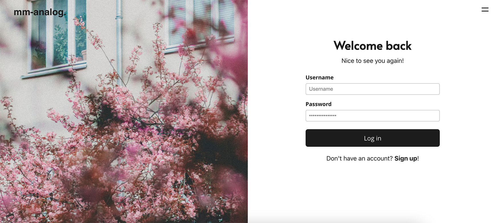

# mm-analog.

_mm-analog._ is een webapplicatie voor analoge fotografie. Binnen de applicatie kunnen fotografen film stock voorraden, fotoprojecten en film ontwikkel logs bijhouden. De applicatie is ontwikkeld als eindopdracht voor de Bootcamp Full Stack Developer van NOVI Hogeschool en bestaat uit verschillende onderdelen waaronder een frontend en een backend. Voor de eindopdracht zijn ook een functioneel ontwerp, een technisch ontwerp, installatiehandleiding en verantwoordingsdocument opgesteld. Zowel de frontend als de backend broncode zijn geschreven in het Engels. De documenten zijn geschreven in het Nederlands.

_Photo by SAJAD FI on Unsplash_

De backend broncode kan bezocht worden via onderstaande link:

[mm-analog-backend](https://github.com/JenMila-2/mm-analog-backend)

De repository waar we ons nu bevinden is bedoeld voor de frontend broncode.

### Downloaden frontend broncode

Om de frontend broncode te downloaden kan de ZIP-file onder de blauwe knop Code gedownload worden.

De broncode kan ook gekloond worden via onderstaande links:

SHH: `git@github.com:JenMila-2/mm-analog-frontend.git`

HTTPS: `https://github.com/JenMila-2/mm-analog-frontend.git` 

Voor de ontwikkeling van de frontend is gebruikgemaakt van React en JavaScript met NPM als dependency manager.

De frontend broncode bestaat uit de volgende onderdelen:
* Assets
* Components
* Context
* Helpers
* Pages 

### Installatie

In de installatiehandleiding wordt stap voor stap uitgelegd hoe de frontend geïnstalleerd kan worden en welke dependencies er nodig zijn.

Om de frontend te kunnen gebruiken is het belangrijk om eerst de npm dependencies te installeren. Dit kan door het volgende commando in de terminal in te voeren: `npm install`

Zodra bovenstaande commando uitgevoerd is kan de applicatie gestart worden.
Voer in de terminal het volgende commando in: `npm start`

Na uitvoering van npm start zal de applicatie automatisch opstarten in de browser. De applicatie zal gerund worden op http://localhost:3000

### Gebruikersinstellingen

Om de werking van de applicatie te tonen zijn dummy gebruikers opgesteld en is in de backend een data.sql file gevuld met voorbeeld data. Om zelf te ontdekken hoe dit werkt kan ingelogd worden met een van de twee dummy accounts.

**Admin2**

**User2**

De juiste inloggegevens zijn te vinden in de installatiehandleiding. 

_Photo by Danny Feng on Unsplash_

_Photos by:_
_SAJAD FI on Unsplash_,
_Robin Spielmann on Unsplash_ &
_Tibor Krizsak on Unsplash_
